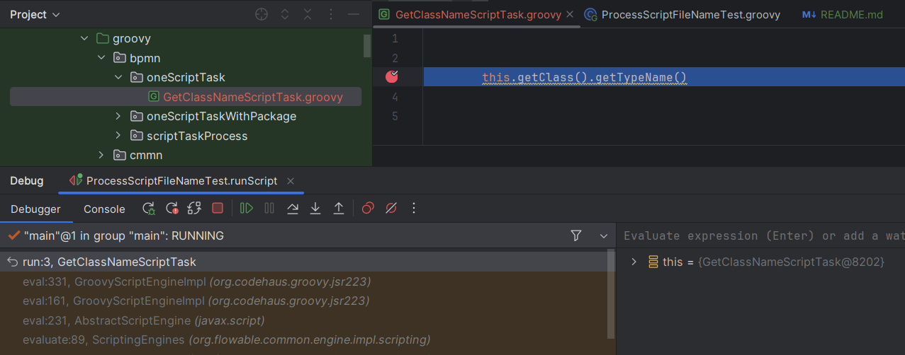
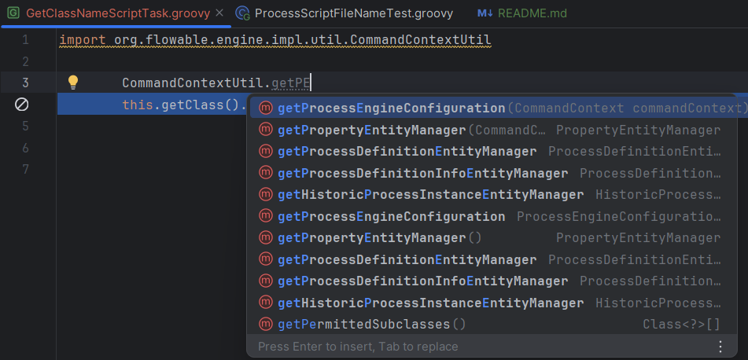

# Groovy Script Development

Implementing Groovy scripts in Flowable process or case script tasks has always been challenging. The editing support in designers
is poor and support for debugging is completely missing. The scripts were a major topic on the
[flowfest 2022](https://www.youtube.com/watch?v=JEoVYyUMz0A&feature=youtu.be). The two main script
implementation issues were present before and remain:
1. editor autocomplete,
2. debugger.

Both of them are very well-supported in any java IDE. Let's use the standard java IDE for flowable groovy script debugging. 

## Configuration
Add `crp-flowable-groovy` dependency to your project:
```xml
		<dependency>
			<groupId>io.github.crystal-processes</groupId>
			<artifactId>crp-flowable-groovy</artifactId>
			<version>${crp-flowable-ex.version}</version>
			<scope>test</scope>
		</dependency>
```
Where `${crp-flowable-ex.version} >= 0.0.7-SNAPSHOT`. The scope depends on the script usage. 

Add following resolver to [process](https://github.com/crystal-processes/crp-flowable-ex/blob/3c9cdd10fd81fc3ddfa8c550db95c842a521c8ab/crp-flowable-groovy/src/test/resources/flowable.cfg.xml#L55-L59)
and [cmmn engine](https://github.com/crystal-processes/crp-flowable-ex/blob/3c9cdd10fd81fc3ddfa8c550db95c842a521c8ab/crp-flowable-groovy/src/test/resources/flowable.cmmn.cfg.xml#L24-L28)
configurations:

```xml
		<property name="postDefaultResolverFactories">
			<list>
				<bean class="org.crp.flowable.groovy.script.ProcessScriptFileNameResolverFactory"/>
			</list>
		</property>
```

The factory provides a resolver to generate a local filesystem script file. The file name is based on the process 
or cmmn models task ids:
```java
    execution.getTenantId() + File.separator + execution.getProcessDefinitionKey() + File.separator + execution.getCurrentActivityId() + getExtension(execution);
```
The content of the file is copied from the script task model. `ProcessScriptFileNameResolverFactory` has two constructor arguments:
```java
    /**
     * Provides a resolver for the script file name for jsr223-compliant script engines. 
     * 
     * @param pathPrefix the prefix path where to store file content if scriptDiffersStrategy allows file content overwriting
     * @param scriptDiffersStrategy defines what to do if file and script content differ. 
     */
    public ProcessScriptFileNameResolverFactory(String pathPrefix, ScriptDiffersStrategy scriptDiffersStrategy)
```
The default values are `src/test/groovy/bpmn/`,`ScriptDiffersStrategy.OVERRIDE`. Path prefix directs the files to the directory
where IDE stores source files to recognize them during debugging. The `ScriptDiffersStrategy` allowed values:
1. `NONE` - do nothing, 
2. `OVERRIDE` - if differs overwrite file, 
3. `THROW` - throw an exception to prevent overwriting changes in the script file.

# Usage
Let's take an example from jUnit tests. One script task process:
```xml
    <process id="oneScriptTaskWithPackage">

        <startEvent id="theStart" />
        <sequenceFlow id="flow1" sourceRef="theStart" targetRef="GetClassNameScriptTask" />

        <scriptTask id="GetClassNameScriptTask" scriptFormat="groovy" flowable:resultVariable="className">
            <script><![CDATA[package oneScriptTask

        this.getClass().getTypeName()


        ]]></script>
        </scriptTask>
        <sequenceFlow id="flow2" sourceRef="GetClassNameScriptTask" targetRef="theEnd" />

        <endEvent id="theEnd" />

    </process>
```
Run the jUnit test [ProcessScriptFileNameTest](https://github.com/crystal-processes/crp-flowable-ex/blob/3c9cdd10fd81fc3ddfa8c550db95c842a521c8ab/crp-flowable-groovy/src/test/groovy/org/crp/flowable/groovy/script/ProcessScriptFileNameTest.groovy#L22-36):
```groovy
    @Test
    @Deployment(resources= 'org/crp/flowable/groovy/script/oneScriptTask.bpmn20.xml')
    void runScript(RuntimeService runtimeService) {
        def scriptProcess = runtimeService.createProcessInstanceBuilder().processDefinitionKey('oneScriptTask').start()
    ...
```
The first test execution generates `src/test/groovy/bpmn/GetClassNameScriptTask.groovy` file with the content exactly 
the same as process model script:
```groovy


        this.getClass().getTypeName()

        
```
Put the break point into `GetClassNameScriptTask.groovy` and debug the `org.crp.flowable.groovy.script.ProcessScriptFileNameTest.runScript` again:


Our execution has reached the break point. We can evaluate any expression in the execution context. Editor hints work as
expected for any groovy file.
